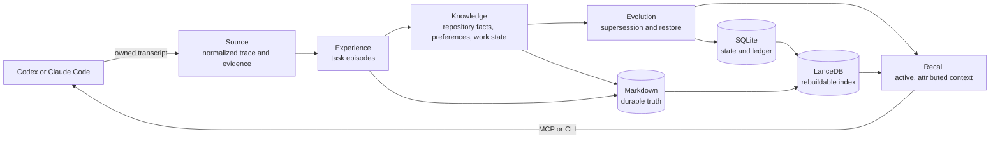

<h1 align="center">CodeCairn</h1>

<p align="center">
  <strong>English</strong> | <a href="README.zh-CN.md">简体中文</a>
</p>

<p align="center">
  <strong>Local, auditable memory for Codex and Claude Code.</strong>
</p>

<p align="center">
  CodeCairn turns completed coding sessions into repository memory that survives
  the session, the context window, and the agent that created it.
</p>

<p align="center">
  <a href="https://github.com/Hackerismydream/CodeCairn/actions/workflows/ci.yml"></a>
  <a href="https://github.com/Hackerismydream/CodeCairn/releases/tag/v0.1.0-rc1"></a>
  
  
  <a href="LICENSE"></a>
</p>

<p align="center">
  <a href="#quick-start">Quick start</a> ·
  <a href="#how-it-works">How it works</a> ·
  <a href="#evidence-backed-results">Evidence</a> ·
  <a href="docs/INDEX.md">Documentation</a>
</p>

---

Coding agents do useful work, then lose the details when a session ends.
CodeCairn keeps the goal, decisions, outcomes, repository knowledge, working
preferences, and unfinished state close to the repository. A later Codex or
Claude Code session can recall that history as bounded context with links back
to the source.

CodeCairn owns memory independently from the coding agent. Your agent still
owns planning, tool use, and code changes. The memory remains local,
inspectable, portable, and available when you switch clients.

## Why CodeCairn

| What you need | What CodeCairn does |
|---|---|
| Memory that survives a session | Captures owned Codex and Claude Code transcripts through explicit session-end hooks or manual import |
| Context you can trust | Derives provenance, roles, command outcomes, file changes, and quotes from normalized events rather than model output |
| Knowledge that can change | Supersedes stale repository knowledge and work state without deleting history |
| Recall that fits the task | Admits relevant lexical or vector candidates, may return no memory, and compiles active results into a token-bounded context |
| Data you can inspect | Keeps durable memory in Markdown, operational state in SQLite, and a rebuildable search projection in LanceDB |
| One product across clients | Exposes the same application service through CLI, seven MCP tools, one MCP resource, Codex or Claude Code hooks, and an installed Pico MemoryBackend |

## Quick start

CodeCairn 0.1 requires Python 3.12 and
[`uv`](https://docs.astral.sh/uv/). The release candidate is not published on
PyPI yet, so install it from a checkout or the built wheel.

```bash
git clone https://github.com/Hackerismydream/CodeCairn.git
cd CodeCairn
uv tool install .
```

Move to the Git repository whose memory CodeCairn should own:

```bash
cd /path/to/your/repository
codecairn init
codecairn doctor
```

`init` writes a non-secret repository binding into the Git common directory.
Runtime data defaults to `~/.codecairn`. The default retrieval profile is local
FastEmbed unless DashScope is explicitly configured, and semantic extraction is
visibly disabled by default.

### Connect Codex

```bash
codex mcp add codecairn -- codecairn-mcp

codecairn hook install --codex --dry-run
codecairn hook install --codex
```

Inspect the generated hook settings, reopen the repository, and complete
Codex's normal trust review.

### Connect Claude Code

```bash
claude mcp add codecairn -- codecairn-mcp

codecairn hook install --claude --dry-run
codecairn hook install --claude
```

Finish one coding task and let the supported Stop or SessionEnd boundary
capture it. In the next task, call the MCP `recall` tool. Repeated hook delivery
and repeated transcript import are idempotent.

You can also test the loop without a client integration:

```bash
codecairn import /path/to/owned-session.jsonl --finalize
codecairn recall "What should I know before the next task?" --format markdown
codecairn doctor
```

For Pico, initialize the repository first; the installed CodeCairn wheel
contributes backend `codecairn` through Pico's plugin registry. Pico selects
CodeCairn as its current long-term memory backend. The first joint campaign
proved continuity but exposed forced top-k recall; current CodeCairn may
explicitly return no memory for an unrelated task.

The complete install, trust, privacy, rollback, and acceptance path is in
[`docs/runtime/installation.md`](docs/runtime/installation.md).

## How it works



The five layers separate source authority from interpretation and retrieval:

| Layer | Responsibility | Version 0.1 output |
|---|---|---|
| Source | Normalize provider transcripts and derive provenance facts | Agent Trace and Evidence References |
| Experience | Bound one user task, its actions, and observed outcome | Task Experience |
| Knowledge | Keep reusable repository facts and active state | Repository Knowledge, Repository Working Preference, Work State |
| Evolution | Append lifecycle decisions without rewriting old memory | Supersession and forward-only restore |
| Recall | Select active memory and compile task-shaped context | Markdown Recall Context plus JSON sidecar |

Source and Recall are boundaries, not extra memory types. Task Experience is
append-only. Repository Knowledge, Repository Working Preference, and Work
State can evolve through an immutable supersession ledger.

### Storage has one authority per job

```text
Markdown  durable, human-readable memory
SQLite    cursors, mirrors, queues, write intents, lifecycle projection
LanceDB   disposable lexical and vector search projection
```

Delete the index and CodeCairn can rebuild it from Markdown. A model may
summarize a task or propose knowledge, but it cannot author provenance, exact
quotes, message roles, command outcomes, changed files, or verification facts.

## What the agent can use

The stdio MCP server exposes seven tools and one resource template:

```text
recall
remember
list_memories
get_memory
memory_history
import_session
doctor

codecairn://memory/{memory_id}
```

`recall` returns task-shaped context. `remember` accepts durable repository
knowledge, working preferences, and work state. Session import owns Task
Experience, so an agent cannot manufacture one through `remember`.

CLI, MCP, and hooks call the same application service. CodeCairn 0.1 has no
HTTP server, remote MCP transport, hidden prompt injection, or background
watcher.

The full command and failure contract is documented in
[`docs/runtime/operations.md`](docs/runtime/operations.md). Reviewable
`AGENTS.md` and `CLAUDE.md` snippets live in
[`docs/runtime/agent-instructions.md`](docs/runtime/agent-instructions.md).
CodeCairn never edits those instruction files automatically.

## Evidence-backed results

Every number below comes from the checked-in
[`v0.1-rc1 evidence bundle`](evidence/v0.1-rc1/RELEASE_NOTES.md), which binds
the result to implementation commit
[`f2358a7`](https://github.com/Hackerismydream/CodeCairn/commit/f2358a77696f38283a237d9be67ec514885aff76).

| Evaluation | Result | Raw evidence |
|---|---|---|
| LoCoMo full | **1,264 / 1,540, 82.08%** with zero final infrastructure failures | [`aggregate.json`](evidence/v0.1-rc1/raw/locomo/full/aggregate.json) |
| CodingMemoryBench-20 | **80% memory-off to 100% memory-on**, a 20 percentage-point increase across 120 isolated Codex runs | [`summary.json`](evidence/v0.1-rc1/raw/coding/summary.json) |
| Retrieval | **97% Recall@5**, 100% provenance coverage, 0 stale-memory leakage, 39.48 ms P95 | [`aggregate.json`](evidence/v0.1-rc1/raw/offline/retrieval/aggregate.json) |
| Scale and idempotency | **1,000 sessions and 100,000 events**, 1,000 unique Episodes, 0 duplicates on repeat import, 55.03 s | [`aggregate.json`](evidence/v0.1-rc1/raw/offline/scale/aggregate.json) |
| Real clients | Native Codex and Claude Code hook trigger, receipt, repeat delivery, and next-session recall verified | [`real-clients.json`](evidence/v0.1-rc1/raw/reports/real-clients.json) |
| Recovery | All eight release-critical write-intent crash boundaries passed | [`recovery.json`](evidence/v0.1-rc1/raw/reports/recovery.json) |

The bundle also records provider identity, cost boundaries, manifests, raw
question results, client versions, artifact hashes, and known limitations.
`codecairn evidence verify` recomputes the public reports without provider
credentials.

```bash
codecairn evidence verify evidence/v0.1-rc1
```

Historical benchmark bundles remain under `evidence/benchmark-v*` and are not
presented as current release-candidate evidence.

## Built to be learned

CodeCairn keeps the system small enough to read as a project:

| Source budget | Current release |
|---|---:|
| Product core | 9,700 Python lines |
| Complete package, including evaluation | 13,978 Python lines |
| Automated tests | 188 |

Dependencies point inward:

```text
entrypoints -> service -> memory
                 ^          ^
                 |          |
             importers   storage adapters
```

Start with the
[`version 0.1 walkthrough`](docs/v0.1/walkthrough.md), then follow the
[`learning path`](docs/v0.1/learning-path.md) through the domain, service,
storage, integrations, and evidence code. The complete maintained document map
is in [`docs/INDEX.md`](docs/INDEX.md).

## Configuration and privacy

The default FastEmbed profile keeps embedding local but may download pinned
model artifacts. The optional DashScope profile sends embedding input to the
configured endpoint. Semantic extraction uses a separate explicit profile and
is disabled by default.

Repository bindings never store provider keys. Runtime roots, namespace
exports, hook receipts, imported transcripts, and benchmark artifacts can
contain source material and should not be committed.

Run `codecairn doctor` to see the active namespace, Markdown state, cursor
state, queue health, index parity, retrieval profile, and provider posture
without exposing credentials.

## Development

```bash
uv sync --locked --all-packages --all-groups
npm ci
make format
make check
make docs-check
make evidence-verify EVIDENCE_BUNDLE=evidence/v0.1-rc1
```

CI also enforces the source budget, architecture dependency rules, type checks,
artifact contents, and evidence integrity.

Contribution and security boundaries are documented in
[`CONTRIBUTING.md`](CONTRIBUTING.md) and [`SECURITY.md`](SECURITY.md).

Run the local read-only Memory Hub against the current repository binding:

```bash
make hub-dev
```

See the [`Hub application`](apps/hub-web/README.md) and
[`workspace layout`](docs/workspace.md).

## Version 0.1 scope

CodeCairn 0.1 is the complete coding-first Memory OS foundation. Version 0.2
adds the Pico integration and auditable recall abstention.

## Roadmap

The product sequence is: v0.3 read-only Memory Hub and readability pass, v0.4
human memory governance, v0.5 local daemon, v0.6 Case and Skill evolution, and
v1.0 stable local Memory OS. Remote collaboration follows only after the local
semantic and storage contract is stable. See the
[`maintained roadmap`](docs/roadmap.md).

The checked-in [`Hub application`](apps/hub-web/README.md) now connects its
three views to a foreground local adapter and real `CodeCairnApplication`
reads. The
[`version 0.3 acceptance infrastructure`](docs/v0.3/hub-acceptance.md) now
freezes a retry-policy scenario, checks fresh-process Pico continuity through
public CodeCairn and Hub reads, binds Chinese participant answers to the exact
snapshot, requires separate human blind review, and seals an offline-verifiable
bundle. It does not use an LLM judge.

This is not a completed version 0.3 result. A source-checkout pilot cannot be
release-eligible. Formal acceptance still requires an installed Hub
distribution and raw collector, a real Pico process run against the declared
configured LLM, five eligible first-time target learners, their blind human
reviews, and a sealed verified artifact. The current Hub is not bundled in the
root release artifacts.

## License

CodeCairn is available under the [MIT License](LICENSE).
