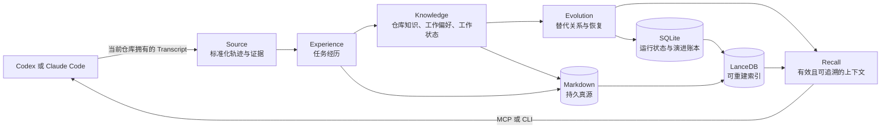

<h1 align="center">CodeCairn</h1>

<p align="center">
  <a href="README.md">English</a> | <strong>简体中文</strong>
</p>

<p align="center">
  <strong>为 Codex 和 Claude Code 提供本地、可审计的长期记忆。</strong>
</p>

<p align="center">
  CodeCairn 把已经完成的 Coding Agent 会话整理成仓库记忆。
  会话结束、上下文窗口重置或更换 Agent 后，这些记忆仍然留在项目中。
</p>

<p align="center">
  <a href="https://github.com/Hackerismydream/CodeCairn/actions/workflows/ci.yml"></a>
  <a href="https://github.com/Hackerismydream/CodeCairn/releases/tag/v0.1.0-rc1"></a>
  
  
  <a href="LICENSE"></a>
</p>

<p align="center">
  <a href="#快速开始">快速开始</a> ·
  <a href="#工作原理">工作原理</a> ·
  <a href="#评测证据">评测证据</a> ·
  <a href="docs/INDEX.md">文档索引</a>
</p>

---

Coding Agent 在一次会话里完成了很多工作，但会话结束后，目标、决策和未完成状态也会随之丢失。
CodeCairn 把任务经历、仓库知识、工作偏好和工作状态保存在仓库附近。后续的 Codex 或
Claude Code 会话可以按当前任务召回这些内容，并沿着引用回到原始来源。

CodeCairn 独立管理记忆。Coding Agent 继续负责规划、工具调用和代码修改。即使更换客户端，
记忆仍然保留在本地，可以直接查看、迁移和追溯。

## 为什么使用 CodeCairn

| 你需要什么 | CodeCairn 如何解决 |
|---|---|
| 跨会话保留记忆 | 通过明确的会话结束 Hook 或手动导入，采集当前仓库拥有的 Codex 和 Claude Code Transcript |
| 可以信任的上下文 | 从标准化事件中推导来源、角色、命令结果、文件变更和原始引用，不让模型自行编造证据 |
| 能够持续演进的知识 | 在不删除历史的前提下，用替代关系更新过期的仓库知识和工作状态 |
| 贴合当前任务的召回 | 合并关键词和向量候选，仅保留有效记忆，经过重排后编译为受 Token Budget 限制的上下文 |
| 可以直接检查的数据 | 使用 Markdown 保存持久记忆，SQLite 管理运行状态，LanceDB 保存可重建的检索投影 |
| 多种 Agent 共用一套记忆 | CLI、7 个 MCP Tools、1 个 MCP Resource 以及 Codex 和 Claude Code Hooks 复用同一套应用服务 |

## 快速开始

CodeCairn 0.1 需要 Python 3.12 和
[`uv`](https://docs.astral.sh/uv/)。当前候选版本尚未发布到 PyPI，请从代码仓库或构建好的
Wheel 安装。

```bash
git clone https://github.com/Hackerismydream/CodeCairn.git
cd CodeCairn
uv tool install .
```

进入需要由 CodeCairn 管理记忆的 Git 仓库：

```bash
cd /path/to/your/repository
codecairn init
codecairn doctor
```

`init` 会把不含密钥的仓库绑定写入 Git Common Directory。运行数据默认保存在
`~/.codecairn`。默认检索方案使用本地 FastEmbed，只有显式配置后才会使用 DashScope。
语义提取默认关闭，并且会在诊断结果中明确显示。

### 接入 Codex

```bash
codex mcp add codecairn -- codecairn-mcp

codecairn hook install --codex --dry-run
codecairn hook install --codex
```

检查生成的 Hook 配置，重新打开仓库，并完成 Codex 正常的信任确认。

### 接入 Claude Code

```bash
claude mcp add codecairn -- codecairn-mcp

codecairn hook install --claude --dry-run
codecairn hook install --claude
```

完成一个开发任务后，让受支持的 Stop 或 SessionEnd 边界触发采集。在下一个任务中调用 MCP
的 `recall` Tool。重复触发 Hook 或重复导入 Transcript 都不会产生重复记忆。

也可以在不接入客户端的情况下手动验证完整闭环：

```bash
codecairn import /path/to/owned-session.jsonl --finalize
codecairn recall "What should I know before the next task?" --format markdown
codecairn doctor
```

完整的安装、信任、隐私、回滚和验收流程见
[`docs/runtime/installation.md`](docs/runtime/installation.md)。

## 工作原理



五层架构把来源事实、记忆解释和检索过程分开：

| 层 | 职责 | 0.1 版本产物 |
|---|---|---|
| Source | 标准化不同 Provider 的 Transcript，并推导来源事实 | Agent Trace 与 Evidence Reference |
| Experience | 确定一次用户任务的边界、执行动作和已观察到的结果 | Task Experience |
| Knowledge | 保存可复用的仓库事实和当前有效状态 | Repository Knowledge、Repository Working Preference、Work State |
| Evolution | 追加生命周期决策，不重写旧记忆 | Supersession 与前向恢复 |
| Recall | 选择当前有效记忆，并编译成适合任务的上下文 | Markdown Recall Context 与 JSON Sidecar |

Source 和 Recall 是系统边界，不是额外的记忆类型。Task Experience 只追加，不修改。
Repository Knowledge、Repository Working Preference 和 Work State 通过不可变的替代关系账本持续演进。

### 每种存储只负责一件事

```text
Markdown  持久、可由人直接阅读的记忆真源
SQLite    Cursor、镜像、队列、Write Intent 与生命周期投影
LanceDB   可以丢弃并重建的关键词与向量检索投影
```

即使删除索引，CodeCairn 也可以从 Markdown 重建。模型可以总结任务或提出候选知识，但不能生成
来源、精确引用、消息角色、命令结果、变更文件或验证事实。

## Agent 可以使用什么

标准输入输出模式的 MCP Server 提供 7 个 Tools 和 1 个 Resource Template：

```text
recall
remember
list_memories
get_memory
memory_history
import_session
doctor

codecairn://memory/{memory_id}
```

`recall` 返回围绕当前任务组织的上下文。`remember` 可以写入持久的仓库知识、工作偏好和工作状态。
Task Experience 只能由 Session Import 生成，因此 Agent 不能通过 `remember` 虚构一段任务经历。

CLI、MCP 和 Hooks 调用相同的应用服务。CodeCairn 0.1 不包含 HTTP Server、远程 MCP
Transport、隐藏式 Prompt Injection 或后台 Watcher。

完整的命令与失败契约见
[`docs/runtime/operations.md`](docs/runtime/operations.md)。可供评审的 `AGENTS.md` 和
`CLAUDE.md` 配置片段见
[`docs/runtime/agent-instructions.md`](docs/runtime/agent-instructions.md)。
CodeCairn 不会自动修改这些指令文件。

## 评测证据

下列每个数字都来自已经提交到仓库的
[`v0.1-rc1 证据包`](evidence/v0.1-rc1/RELEASE_NOTES.md)。证据包把评测结果绑定到实现 Commit
[`f2358a7`](https://github.com/Hackerismydream/CodeCairn/commit/f2358a77696f38283a237d9be67ec514885aff76)。

| 评测 | 结果 | 原始证据 |
|---|---|---|
| LoCoMo 全量评测 | **1,264 / 1,540，82.08%**，最终运行没有基础设施失败 | [`aggregate.json`](evidence/v0.1-rc1/raw/locomo/full/aggregate.json) |
| CodingMemoryBench-20 | Memory-off **80%**，Memory-on **100%**，在 120 次相互隔离的 Codex 运行中提升 20 个百分点 | [`summary.json`](evidence/v0.1-rc1/raw/coding/summary.json) |
| 检索 | **Recall@5 97%**，来源引用覆盖率 100%，过期记忆泄漏率 0，P95 39.48 ms | [`aggregate.json`](evidence/v0.1-rc1/raw/offline/retrieval/aggregate.json) |
| 规模与幂等 | **1,000 个 Session，100,000 条事件**，生成 1,000 个唯一 Episode，重复导入产生 0 个重复项，耗时 55.03 秒 | [`aggregate.json`](evidence/v0.1-rc1/raw/offline/scale/aggregate.json) |
| 真实客户端 | 已验证 Codex 和 Claude Code 原生 Hook 的触发、回执、重复投递与下一会话召回 | [`real-clients.json`](evidence/v0.1-rc1/raw/reports/real-clients.json) |
| 崩溃恢复 | 与发布相关的 8 个 Write Intent 崩溃边界全部通过 | [`recovery.json`](evidence/v0.1-rc1/raw/reports/recovery.json) |

证据包还记录了 Provider 身份、成本边界、Manifest、逐题结果、客户端版本、Artifact Hash 和已知限制。
`codecairn evidence verify` 不需要 Provider 凭据，可以直接重新计算公开报告。

```bash
codecairn evidence verify evidence/v0.1-rc1
```

历史评测包保留在 `evidence/benchmark-v*`，不会被包装成当前候选版本的评测结果。

## 面向学习者的代码结构

CodeCairn 有意识地控制系统规模，让学习者可以完整读懂：

| 代码规模 | 当前版本 |
|---|---:|
| 产品核心 | 9,700 行 Python |
| 完整 Package，包含评测代码 | 13,978 行 Python |
| 自动化测试 | 188 项 |

依赖统一指向内层：

```text
entrypoints -> service -> memory
                 ^          ^
                 |          |
             importers   storage adapters
```

建议先阅读
[`0.1 版本导览`](docs/v0.1/walkthrough.md)，再按照
[`学习路线`](docs/v0.1/learning-path.md)依次阅读领域模型、应用服务、存储、集成和评测代码。
完整且持续维护的文档索引见 [`docs/INDEX.md`](docs/INDEX.md)。

## 配置与隐私

默认的 FastEmbed 方案在本地计算 Embedding，但可能下载已经锁定版本的模型文件。可选的
DashScope 方案会把 Embedding 输入发送到已配置的 Endpoint。语义提取使用单独的显式配置，
并且默认关闭。

仓库绑定不会保存 Provider Key。运行目录、Namespace Export、Hook Receipt、已导入的
Transcript 和评测 Artifact 可能包含源材料，不应提交到代码仓库。

运行 `codecairn doctor` 可以查看当前 Namespace、Markdown 状态、Cursor 状态、队列健康度、
索引一致性、检索方案和 Provider 状态，同时不会暴露凭据。

## 开发与验证

```bash
uv sync --locked --all-groups
make format
make check
make docs-check
make evidence-verify EVIDENCE_BUNDLE=evidence/v0.1-rc1
```

CI 还会检查代码规模预算、架构依赖规则、类型、Artifact 内容和证据完整性。

贡献方式和安全边界见
[`CONTRIBUTING.md`](CONTRIBUTING.md)与 [`SECURITY.md`](SECURITY.md)。

## 0.1 版本边界

CodeCairn 0.1 提供一个完整、面向 Coding Agent 的产品 Profile。Raven 集成、UI 或
Dashboard、云端多租户、远程 MCP Transport、动态 Profile、后台 Skill 演进和独立记忆验证
不在本次发布范围内。

## 许可证

CodeCairn 使用 [MIT License](LICENSE)。
